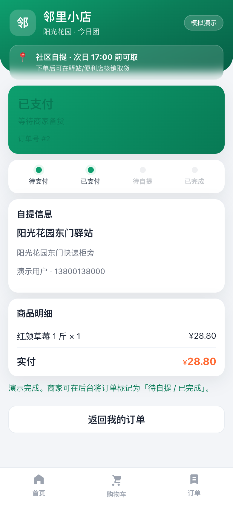
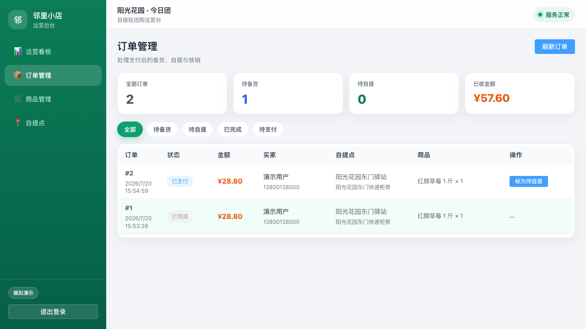

# 邻里小店（社区轻团购 Demo）

作品集项目：商品 → 购物车 → 下单 → **模拟支付** → 后台核销。

> 支付为演示桩，接单时可替换为微信支付。用户端：**H5** + **uni-app 微信小程序壳**（共用同一 API）。

## 目录

| 目录 | 说明 | 本地端口 |
| --- | --- | --- |
| `server/` | FastAPI + SQLite | `8020` |
| `mini/` | 用户端 H5（Vue3） | `5173` |
| `mp/` | uni-app 微信小程序壳 | 微信开发者工具 |
| `admin/` | 管理后台（Vue3 + Element Plus） | `5174` |
| `cfc/` | 百度 CFC HTTPS 网关 | — |

## 本地启动

```bash
# 1) 后端
cd server
python3 -m venv venv && ./venv/bin/pip install -r requirements.txt
./venv/bin/uvicorn app.main:app --reload --port 8020

# 2) 用户端
cd mini && npm install && npm run dev

# 3) 后台
cd admin && npm install && npm run dev

# 4) 微信小程序壳（可选）
cd mp && npm install && npm run dev:mp-weixin
# 用微信开发者工具打开 mp/dist/dev/mp-weixin ，详见 mp/README.md
```

- 用户端：http://127.0.0.1:5173/
- 后台：http://127.0.0.1:5174/ （登录令牌默认 `dev-admin`）

## 测试

```bash
cd server && ./venv/bin/pytest -v
```

## 部署

```bash
# BCC 后端 + nginx /shop-api/
./scripts/deploy-bcc.sh

# 静态（BCC 路径版）
SYNC_BCC_STATIC=1 VITE_API_URL=/shop-api ./scripts/build-web.sh

# CFC 网关（Pages 用 HTTPS）
export BACKEND_URL=http://180.76.180.105/shop-api
export ALLOW_ORIGIN=https://shop.yuchuntest.com
./cfc/scripts/deploy.sh
```

线上：

- 用户端：https://shop.yuchuntest.com/
- 后台：https://shop.yuchuntest.com/admin/ （登录令牌默认 `dev-admin`）
- API 网关：`https://2jng249qsad2r.cfc-execute.bj.baidubce.com`
- BCC 直连（备用）：http://180.76.180.105/shop/ · http://180.76.180.105/shop-admin/

## 演示视频

| 片段 | 文件 |
| --- | --- |
| 用户端：加购 → 下单 → 模拟支付 | [`docs/demo/01-h5-order-pay.webm`](docs/demo/01-h5-order-pay.webm) |
| 后台：标待自提 → 核销完成 | [`docs/demo/02-admin-fulfill.webm`](docs/demo/02-admin-fulfill.webm) |

关键帧：

<p>
  
  
  
</p>

重录：起 `8020` / `5173` / `5174` 后执行 `cd scripts && env -u VITE_API_URL npm run record-demo`。

## 案例说明

见 [`docs/CASE.md`](docs/CASE.md)（场景 / 工期 / 演示账号 / 技术栈）。

## 状态流转

`pending_pay` →（模拟支付）→ `paid` →（后台）→ `ready` → `completed`
